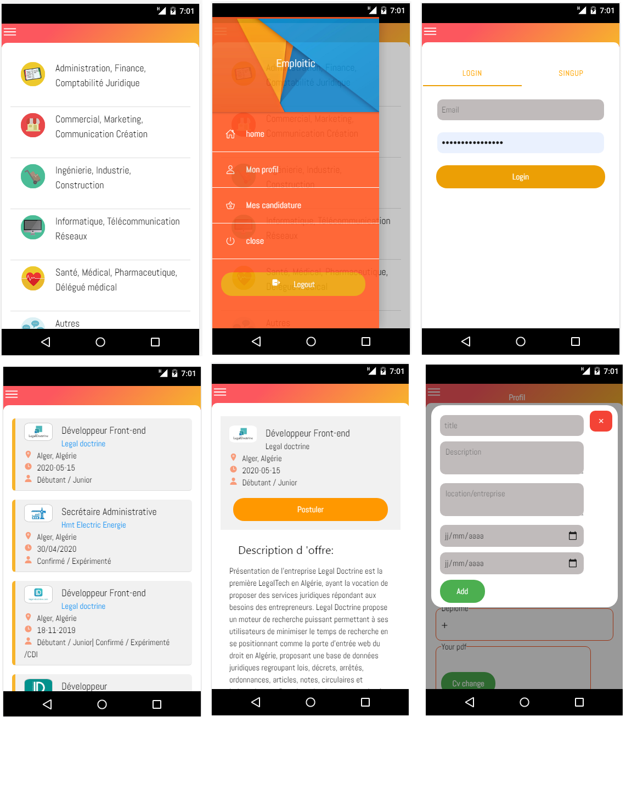

 #  EMPLOITIK DEMO V 0.0.1: React native + Reactjs




## Getting Started

#git clone https://github.com/walidbouatouche/emploitic-ionic-angular.git
###  next step 


```
 cd frontend(reactJs) /ionic (angular)/backend(expressJs)  
```
 

### Installing


```
npm i 
```
 
### run : ionic serve /npm start
## Deployment

#backend(expressJs)

* git add .
* git commit -m " first commit"
* heroku login
* Enter your Heroku credentials.
* heroku create
* git push heroku master


 

#mobil(ionic-angular)
* ionic cordova build android --prod


 
 

 